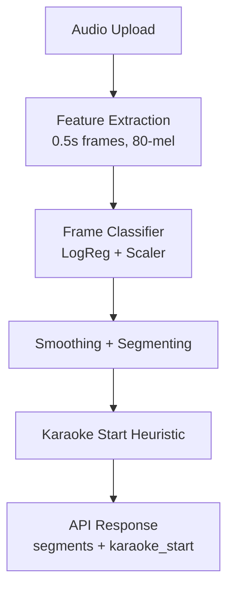

# Architecture (high level)

```mermaid
graph TD
  A[Audio Upload] --> B[Feature Extraction\n0.5s frames, 80-mel]
  B --> C[Frame Classifier\nLogReg + Scaler]
  C --> D[Smoothing + Segmenting]
  D --> E[Karaoke Start Heuristic]
  E --> F[API Response\nsegments + karaoke_start]
```
