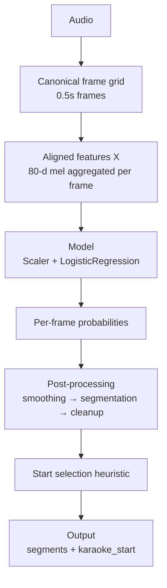

# Design: Lyric Karaoke Start Detector

This project detects where lyrics begin in a song and returns:

- `segments`: contiguous lyric regions `[{start, end}, ...]`
- `karaoke_start`: a recommended "jump time" (ideally the first sustained lyric section)

The implementation intentionally uses a simple model (StandardScaler + LogisticRegression). "Product correctness" comes primarily from a strict time alignment contract and deterministic post-processing.

---

## Core invariant: canonical time grid (the data contract)

**Time is defined once.** All downstream artifacts must conform to the same canonical frame grid:

- training labels
- features
- inference predictions
- output segments / karaoke_start

Default grid: **0.5s frames** (configurable).

Why this matters: you can have matching array shapes while still be wrong if each row represents a different *time meaning* (training–serving skew). This project treats that as a **semantic mismatch**, not a dimensional mismatch.

---

## High-level pipeline

## Canonical frame grid

Given duration_sec and frame_duration (default 0.5s), we build:

- `num_frames = ceil(duration_sec / frame_duration)` to include a final partial frame
- each frame has:
  - `frame_idx`
  - `t_start = frame_idx * frame_duration`
  - `t_end = min(t_start + frame_duration, duration_sec)`

This ensures every subsequent step can index by frame_idx and map cleanly back to timestamps.

## Feature extraction and alignment

Audio is converted into a mel representation, then aggregated onto the canonical grid.

### Aggregation rule (mel → canonical frames)

For each canonical frame [t_start, t_end):

- select mel timesteps whose mel_times fall within the window
- average their mel vectors → one 80-d vector per canonical frame
- if no mel timesteps overlap, emit a zero vector to preserve alignment (represents "silence / missing coverage" but keeps the contract intact)

Output feature matrix X shape:

- `(n_frames, 80)` where `n_frames == len(frame_grid)`

## Model (baseline classifier)

The model is a lightweight baseline:

- StandardScaler + LogisticRegression

The model outputs per-frame lyric presence probabilities:

- `probs = predict_proba(X)[:, 1]` → shape `(n_frames,)`

This is intentionally simple so the repo can focus on the alignment contract, testability, and deterministic robustness.

## Deterministic post-processing

Raw per-frame predictions can flicker (isolated false positives/negatives). We convert probabilities to stable lyric regions using deterministic steps.

### 1) Thresholding

Convert probabilities to a binary vector:

- `is_lyric = probs >= threshold`

The predictor can use different thresholds for:

- segment display (precision-oriented)
- karaoke start selection (recall-oriented)

### 2) Median smoothing

Apply median smoothing over a sliding window (e.g., 5 frames) to remove one-frame spikes.

### 3) Minimum consecutive enforcement

Require sustained positives before accepting a lyric run:

- e.g., `min_consecutive = 3` frames = 1.5s sustained lyrics

This prevents single-frame flicker from becoming segments.

### 4) Segment extraction + cleanup

Convert cleaned binary vector into segments:

- build contiguous [start, end] regions from consecutive positives
- cleanup rules:
  - drop segments under a minimum duration
  - merge segments separated by small gaps (merge-gap tolerance)

Segments always map back to timestamps using the canonical frame boundaries.

## Karaoke start selection heuristic

Goal: choose the earliest reliable lyric region (first verse / first sustained section), without jumping too early on noise.

The chooser evaluates candidate segments using window-based statistics and duration checks.

Key robustness behaviors:

- A single sufficiently long early segment is allowed to qualify.
- Lookahead window logic is overlap-aware (segments that begin before a window but overlap it are counted properly).
- Heuristics are regression-tested against:
  - "flicker" that should not create segments
  - "one long early region" that should not force a late start
  - overlap/window edge cases

## Interfaces

### CLI

`karaoke-predict` runs inference locally and prints JSON:

- inputs: `--model`, `--audio`, optional thresholds/debug
- output: `{ "segments": [...], "karaoke_start": ... }`

### Web demo (Flask)

- `/` serves the upload UI
- `/upload` accepts an audio file, runs the predictor, returns JSON
- safeguards:
  - upload size limit + 413 handler
  - temp-file cleanup
  - model loaded lazily (so the app can start without bundling weights)

## CI / reproducibility without external datasets

The repo avoids shipping copyrighted audio and trained weights.

CI validates the end-to-end plumbing using synthetic data:

- `train_toy.py`: generate aligned synthetic features/labels and train a tiny model
- `smoke_toy_predict.py`: load the toy model and assert inference invariants:
  - exactly one probability per canonical frame
  - outputs are finite (no NaN/inf)

These checks catch alignment regressions and silent numeric issues without needing real audio.

## Testing strategy

Unit tests cover the contract and tricky edge cases:

- frame grid (partial last frame inclusion)
- mel aggregation alignment
- smoothing / min-consecutive behavior (flicker resistance)
- segment extraction + cleanup
- karaoke_start chooser regressions (late-start bug, overlap handling)

If you change core behavior, tests should be updated first (or alongside) to encode expected behavior.